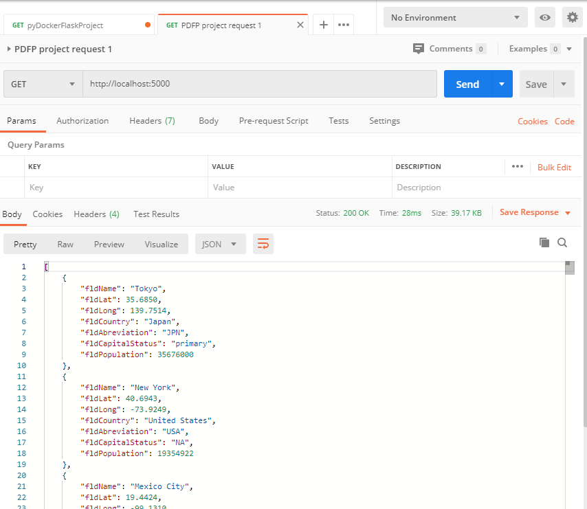
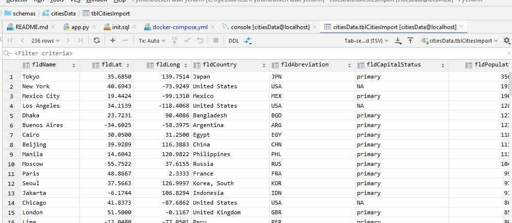
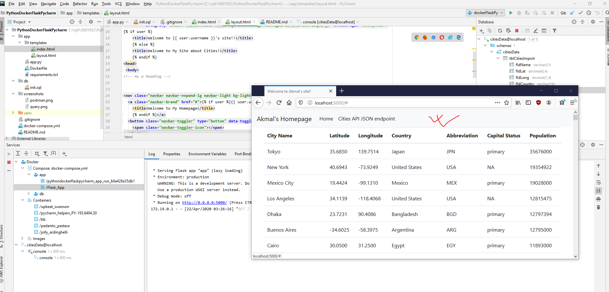

# Python Docker Flask on Pycharm
Homework assignment for hands-on exercise with application setup using Docker, Flask, MySQL and a Postman.

## Postman Screenhot

## SQL Data screenshot

## Homepage screenshot
